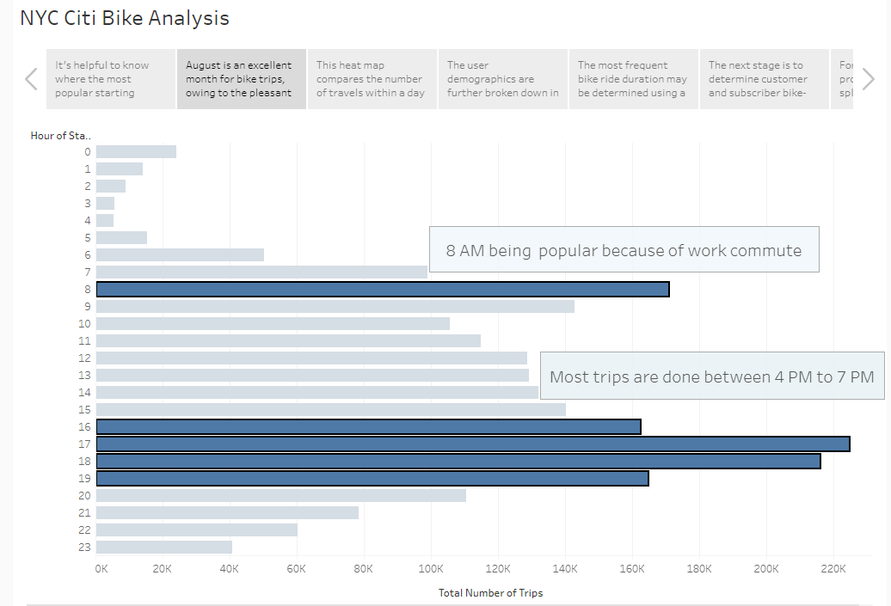
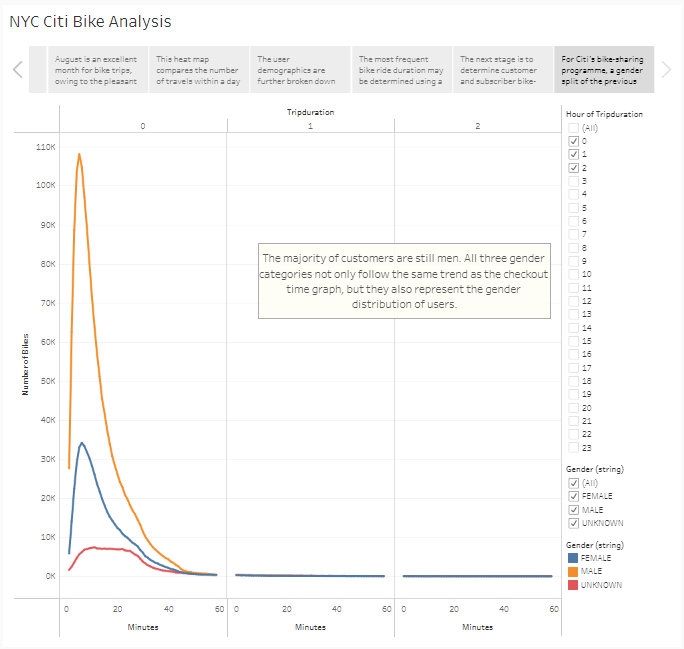
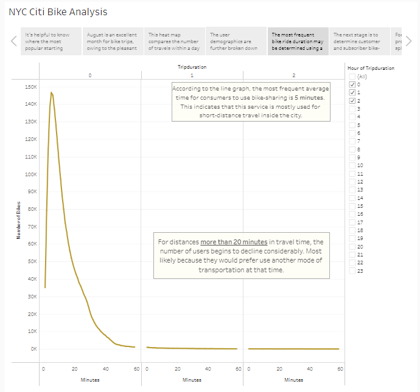
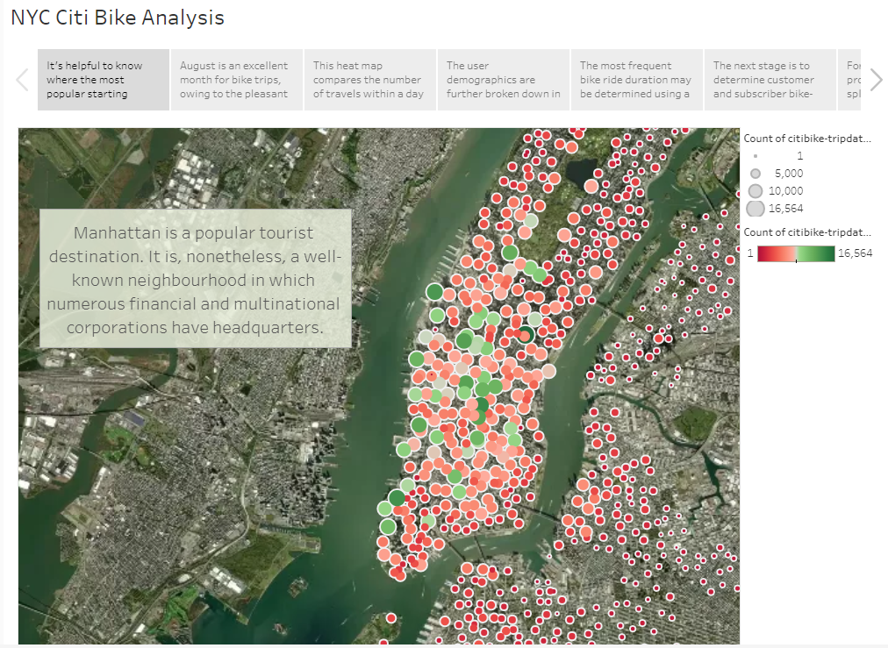
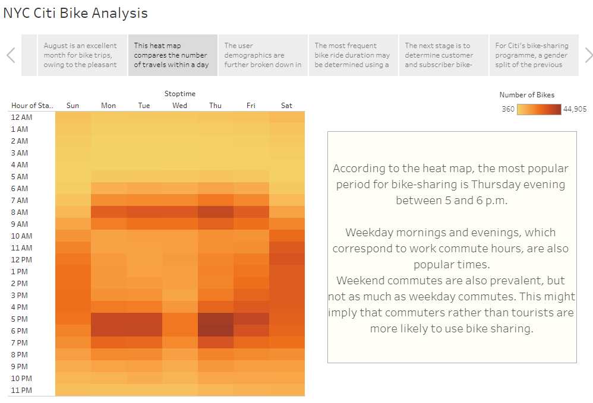
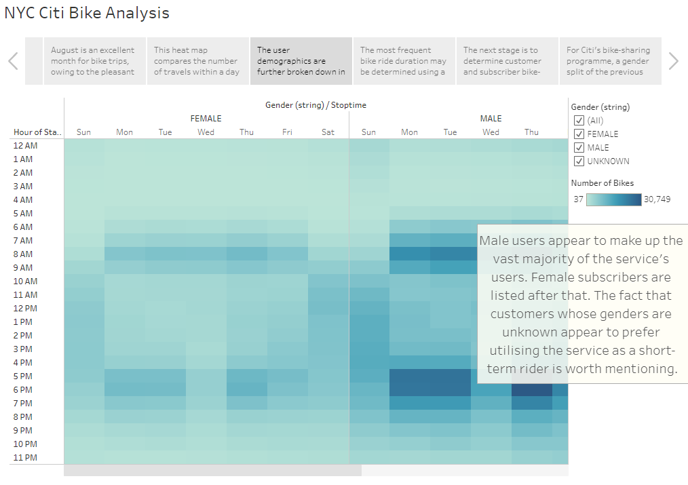
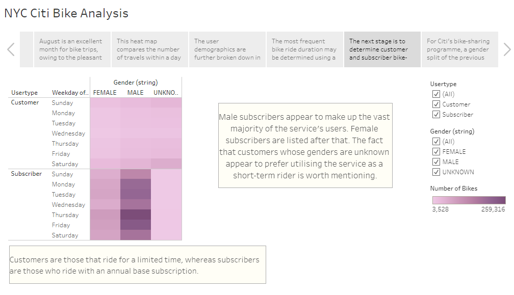

# bikesharing
You can view the dashboard on Tableau here: [NYC Citi Bike-Sharing Analysis Dashboard](https://public.tableau.com/shared/FCQXP589C?:display_count=n&:origin=viz_share_link)

## Overview of Analysis
The goal of this study is to come up with a plan that will convince investors to fund a bike-sharing scheme in Des Moines, Iowa. We were able to construct visuals based on the supplied statistics to illustrate average bike length trends and the links between gender and popular biking times. This series of visualization, in particular:

- Show the amount of time that all riders and genders have their bikes checked out.
- For each hour of each day of the week, display the number of bike journeys for all riders and genders.
- For each day of the week, display the number of bike journeys for each kind of user and gender.
## Results
The following are the analysis and visualization results:

## Summary
Because most of the peak periods are around morning and evening commutes, we may assume that majority of these people are not tourists but rather work commuters. Furthermore, the bulk of the users were men. Although this may not seem substantial, it will come in handy for future marketing campaigns. Another noteworthy finding is that the majority of the rides lasted between 5 and 10 minutes. If Des Moines were to implement a bike-sharing service, it would be beneficial if each station was within 10 minutes of each other by bike. This is due to the fact that New York City is a huge city, whereas Des Moines is mostly suburbs. When compared to sites in major cities, suburbs have a longer distance between them.
